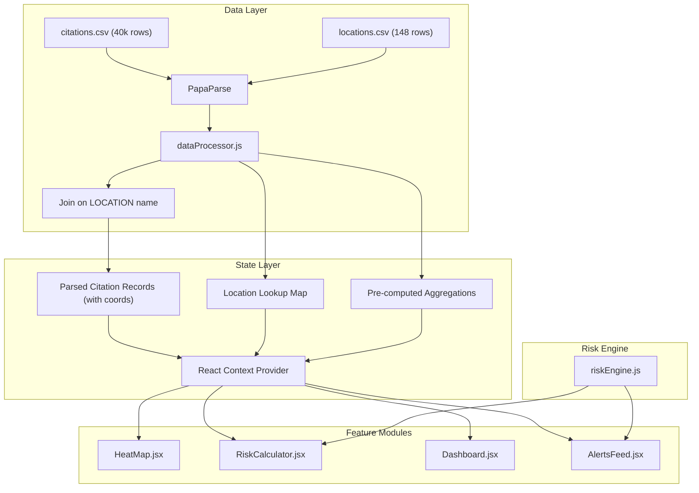
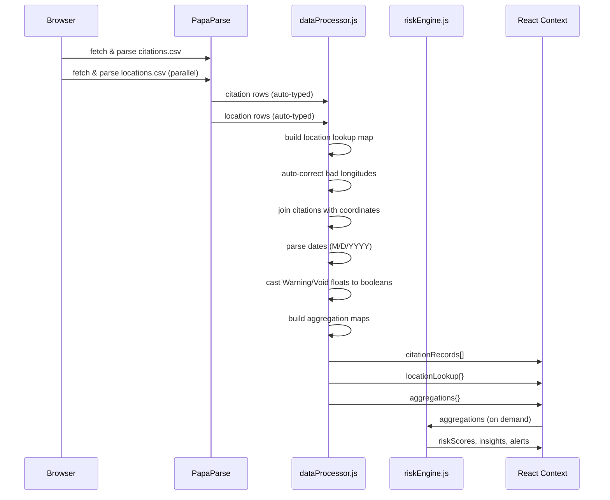
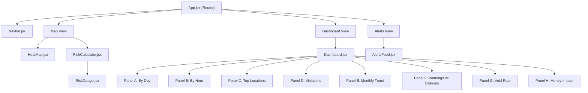
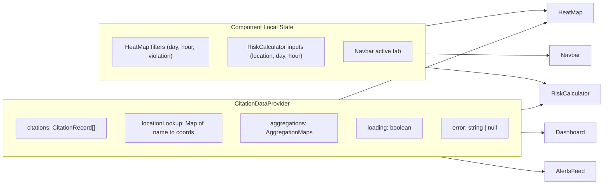
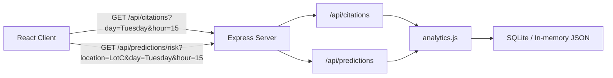
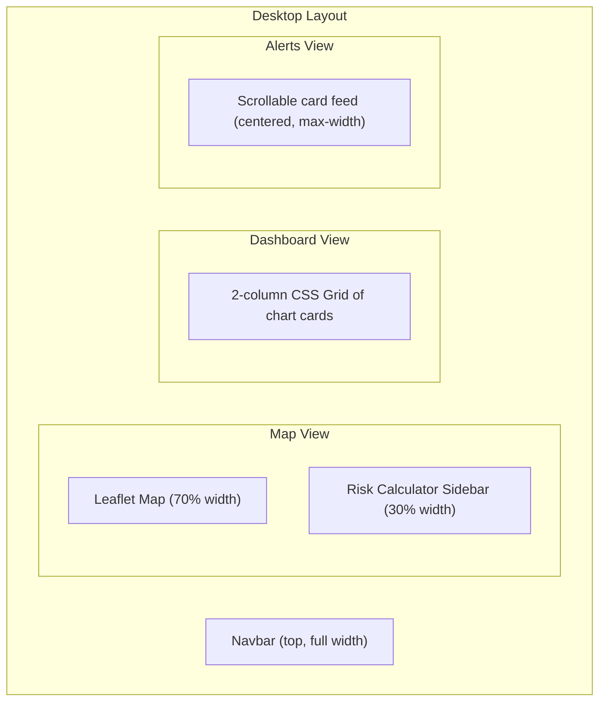

# ATLAS — Architecture Document

This document describes the system architecture, data flow, component design, algorithms, and design decisions behind ATLAS (ParkSmart).

---

## Table of Contents

1. [System Overview](#system-overview)
2. [High-Level Architecture](#high-level-architecture)
3. [Data Flow](#data-flow)
4. [Frontend Architecture](#frontend-architecture)
5. [Utility Modules](#utility-modules)
6. [State Management](#state-management)
7. [Backend Architecture (Optional)](#backend-architecture-optional)
8. [Algorithms](#algorithms)
9. [UI/UX Architecture](#uiux-architecture)
10. [Performance Considerations](#performance-considerations)

---

## System Overview

ATLAS is a client-heavy single-page application (SPA) built with React. The core design principle is **compute once, filter fast**: raw CSV data is parsed and aggregated into lookup tables on initial load, and all subsequent user interactions (filtering, risk calculation, chart rendering) read from those pre-computed structures without re-processing.

An optional Express backend exists for scenarios where server-side processing or a persistent database (SQLite) is preferred, but the application is fully functional as a static client-only build.

---

## High-Level Architecture



---

## Data Flow

The data pipeline runs once on application startup:



### Step-by-step

1. **Fetch both CSVs** — The browser fetches `public/data/citations.csv` and `public/data/locations.csv` in parallel via PapaParse with `dynamicTyping: true` and `header: true`.
2. **Build location lookup** — `dataProcessor.js` iterates the location CSV rows and builds a `Map<locationName, { lat, lng }>`. For each row, it parses the `Coordinates` string (splitting on comma) or falls back to `LATITUDE`/`LONGITUDE` columns. Positive longitudes are auto-corrected to negative (data quality fix for `1329 R Street`). ~15 locations with no coordinates are omitted from the map but tracked for stats.
3. **Join and transform** — For each citation row, `dataProcessor.js`:
   - Looks up the citation's `LOCATION` in the location map and attaches `lat`/`lng` (or `null` if no match).
   - Parses `Issue Date` from M/D/YYYY into a `Date` object (extracting month/year for trend charts).
   - Casts `Warning` and `Void` from `0.00`/`1.00` floats to booleans (`>= 1`).
4. **Aggregation** — Pre-compute lookup tables in a single pass over the joined records:
   - `byLocationDayHour`: `Map<"LOC|DAY|HOUR", { count, totalFines, violations, warnings, voids }>` — the primary structure for risk scoring and heatmap filtering.
   - `byDayOfWeek`: citation counts per day (Panel A).
   - `byHour`: citation counts per hour (Panel B).
   - `byLocation`: citation counts and total fines per location (Panel C).
   - `byViolation`: citation counts per `CODE`/`Description` (Panel D).
   - `byMonth`: citation counts per YYYY-MM (Panel E).
   - `warningsByLocation`: warnings vs. citations per location (Panel F).
   - `voidRateByCode`: void count / total count per `CODE` (Panel G).
   - `totalFines`, `avgFine`, `totalCitations`: scalar stats (Panel H).
5. **Context hydration** — The parsed records array, the location lookup map, and the aggregation maps are stored in a React Context Provider that wraps the entire app.
6. **Risk engine** — `riskEngine.js` consumes the `byLocationDayHour` map on demand to calculate risk scores and generate insight alerts.

---

## Frontend Architecture

### Component Hierarchy



### Component Details

#### `App.jsx`

The root component. Wraps the entire tree in the `CitationDataProvider` context. Renders `Navbar` and a view container that swaps between Map, Dashboard, and Alerts based on the active tab (client-side routing via React Router or simple state toggle).

#### `Navbar.jsx`

Tab navigation bar with three items: **Map**, **Dashboard**, **Alerts**. Fixed at the top of the viewport. Responsive — collapses to icons on small screens.

#### `HeatMap.jsx`

- Initializes a Leaflet `MapContainer` centered at `[40.824, -96.701]` (Lincoln, NE) with zoom level 16.
- Renders a `leaflet.heat` heatmap layer from citation records that have coordinates (joined from the location lookup). Citations with no coordinate match are silently excluded from the heat layer.
- Exposes filter controls:
  - **Day of week**: toggle button group (Mon–Sun).
  - **Time range**: range slider (0–23 hours).
  - **Violation type**: multi-select dropdown populated from unique `CODE`/`Description` values.
- Filters are applied client-side by subsetting the citation records and regenerating the heat layer points.
- Clicking a hotspot cluster opens a Leaflet popup displaying: location name, total citations in cluster, most common violation, total fines.

#### `RiskCalculator.jsx`

- Sidebar panel on the Map view (or a dedicated sub-page on mobile).
- Three input selectors:
  - **Location**: dropdown populated from unique `LOCATION` values, or click-to-select on the map.
  - **Day of week**: dropdown (Monday–Sunday).
  - **Time**: hour picker (0–23).
- On selection, calls `riskEngine.calculateRisk(location, day, hour)` and passes the result to `RiskGauge`.
- Displays contextual stats below the gauge:
  - "X citations were issued here on [Day]s between [Hour]:00 and [Hour+1]:00"
  - "Most common violation: [Description]"
  - "Average fine: $[amount]"
- Shows 2–3 alternative locations with lower risk at the same day/hour.

#### `RiskGauge.jsx`

A visual gauge component rendering the 0–100 risk score:
- **0–33**: green background, "Low Risk" label.
- **34–66**: yellow/amber background, "Moderate Risk" label.
- **67–100**: red background, "High Risk" label.
- Rendered as a semicircular arc or horizontal progress bar with color gradient (blue-to-red).

#### `Dashboard.jsx`

Container for the eight chart panels arranged in a responsive CSS Grid (2 columns on desktop, 1 column on mobile). Each panel is a card with a title, subtitle, and a Recharts chart component.

| Panel | Recharts Component | Data Source |
|-------|-------------------|-------------|
| A — Citations by Day | `BarChart` | `aggregations.byDayOfWeek` |
| B — Citations by Hour | `AreaChart` / `LineChart` | `aggregations.byHour` |
| C — Top 10 Locations | `BarChart` (horizontal) | `aggregations.byLocation` (top 10) |
| D — Violation Breakdown | `PieChart` | `aggregations.byViolation` |
| E — Monthly Trend | `LineChart` | `aggregations.byMonth` |
| F — Warnings vs. Citations | `BarChart` (stacked) | `aggregations.warningsByLocation` |
| G — Void Rate | `BarChart` | `aggregations.voidRateByCode` |
| H — Money Impact | Stat card (custom) | `aggregations.totalFines`, `avgFine` |

#### `AlertsFeed.jsx`

Renders a scrollable vertical feed of insight cards. Cards are generated dynamically by `riskEngine.generateInsights()` and sorted by severity (highest risk first). Each card has:
- An icon indicating severity (high-risk, tip, warning).
- A human-readable message, e.g.:
  - "High Risk: Lot C sees 3x more tickets on Wednesdays between 10–11am"
  - "Tip: Lot F has 40% fewer citations than Lot C at the same time"
  - "Peak enforcement hours at [Location] are [Time Range]"

---

## Utility Modules

### `dataProcessor.js`

Responsibilities:
- **`loadData(citationsUrl, locationsUrl)`** — Fetches both CSVs in parallel via PapaParse, returns raw row arrays for each.
- **`buildLocationLookup(locationRows)`** — Builds a `Map<locationName, { lat, lng }>` from the location CSV. Parses the `Coordinates` string (splitting on comma) or falls back to `LATITUDE`/`LONGITUDE` columns. Auto-corrects positive longitudes (e.g., `1329 R Street` has `96.70` instead of `-96.70`). Locations with no coordinate data are omitted from the map.
- **`transformRow(row, locationLookup)`** — Parses a single citation row into a clean record object:
  - Looks up `row.LOCATION` in `locationLookup` and attaches `lat`/`lng` (or `null` if the location has no coordinates).
  - Parses `Issue Date` into a `Date`, extracts `month` and `year`.
  - Casts `Warning`/`Void` from `0.00`/`1.00` floats to booleans (`>= 1`).
- **`buildAggregations(records)`** — Iterates all records once and builds the aggregation maps described in the Data Flow section. All aggregations include all records regardless of coordinate availability; only the heatmap rendering filters out `null`-coordinate records.

### `riskEngine.js`

Responsibilities:
- **`calculateRisk(location, day, hour, aggregations)`** — Looks up the `(location, day, hour)` bucket in `byLocationDayHour`, divides its count by the max bucket count, multiplies by 100, clamps to 0–100.
- **`getAlternatives(day, hour, aggregations, excludeLocation, limit=3)`** — Finds locations at the same `(day, hour)` with the lowest citation counts, excluding the queried location. Returns up to `limit` results with their risk scores.
- **`generateInsights(aggregations)`** — Identifies the top 5 highest-count `(location, day, hour)` buckets, generates alert objects with type, message, and severity. For each, also generates a recommendation pointing to the lowest-risk alternative.

---

## State Management



**Global state** (React Context):
- `citations` — The full array of parsed citation record objects (each with `lat`/`lng` attached from the location join, or `null` for locations without coordinates).
- `locationLookup` — The `Map<locationName, { lat, lng }>` built from the location mapping CSV. Used by the heatmap for rendering and by the risk calculator for map interactions.
- `aggregations` — All pre-computed aggregation maps.
- `loading` — Boolean flag, true while CSVs are being fetched/parsed/joined.
- `error` — Error message if either CSV load fails.

**Local state** (component-level `useState`):
- Filter selections in `HeatMap` (selected days, hour range, violation types).
- Risk calculator inputs in `RiskCalculator` (selected location, day, hour).
- Active tab in `Navbar`.

This separation keeps the Context stable (it only updates once, on initial load) and avoids unnecessary re-renders. Filter-driven updates are localized to the component that owns the filter state.

---

## Backend Architecture (Optional)

The Express backend is optional. When used, it provides a REST API so the frontend can offload data processing or support multi-user scenarios.



### Routes

**`/api/citations`**
- `GET /` — Returns all citation records. Supports query params for filtering (`day`, `hour`, `code`, `location`).
- `GET /aggregations` — Returns pre-computed aggregation maps for the dashboard.

**`/api/predictions`**
- `GET /risk` — Accepts `location`, `day`, `hour` query params. Returns risk score and contextual stats.
- `GET /alternatives` — Accepts `day`, `hour`, `exclude` query params. Returns sorted list of lowest-risk locations.
- `GET /insights` — Returns the top insight/alert objects.

### `analytics.js`

Server-side equivalent of `dataProcessor.js` and `riskEngine.js`. Loads both CSVs on server startup, builds the location lookup, joins citations to coordinates, builds aggregations, and exposes functions consumed by route handlers.

---

## Algorithms

### Risk Score Calculation

```
function calculateRisk(location, day, hour, aggregations):
    key = `${location}|${day}|${hour}`
    bucketCount = aggregations.byLocationDayHour[key].count  // default 0
    maxCount = aggregations.maxBucketCount

    if maxCount == 0:
        return 0

    score = (bucketCount / maxCount) * 100
    return clamp(score, 0, 100)
```

The score represents how a specific parking spot at a given day/hour compares to the single worst hotspot on campus. A score of 100 means "this is the most-ticketed bucket in the entire dataset."

### Alternative Location Finder

```
function getAlternatives(day, hour, aggregations, excludeLocation, limit=3):
    candidates = []

    for each location in aggregations.uniqueLocations:
        if location == excludeLocation:
            continue
        key = `${location}|${day}|${hour}`
        count = aggregations.byLocationDayHour[key].count  // default 0
        score = calculateRisk(location, day, hour, aggregations)
        candidates.push({ location, score, count })

    sort candidates by score ascending
    return candidates.slice(0, limit)
```

### Insight Generation

```
function generateInsights(aggregations):
    insights = []

    // Sort all (location, day, hour) buckets by count descending
    sortedBuckets = sort(aggregations.byLocationDayHour.entries(), by count desc)
    top5 = sortedBuckets.slice(0, 5)

    for each bucket in top5:
        { location, day, hour, count } = bucket

        // Compare to campus average
        avgCount = aggregations.totalCitations / aggregations.bucketCount
        multiplier = count / avgCount

        insight = {
            type: "HIGH_RISK",
            severity: count,
            message: `${location} sees ${multiplier.toFixed(1)}x more tickets
                      on ${day}s between ${hour}:00–${hour+1}:00`
        }
        insights.push(insight)

        // Find best alternative
        alternatives = getAlternatives(day, hour, aggregations, location, 1)
        if alternatives.length > 0:
            alt = alternatives[0]
            reduction = ((count - alt.count) / count * 100).toFixed(0)
            tip = {
                type: "TIP",
                severity: count * 0.5,
                message: `${alt.location} has ${reduction}% fewer citations
                          than ${location} at the same time`
            }
            insights.push(tip)

    sort insights by severity descending
    return insights
```

---

## UI/UX Architecture

### Design System

- **Theme**: Dark mode by default. Background `#0f172a` (Tailwind `slate-900`), card surfaces `#1e293b` (`slate-800`), text `#f1f5f9` (`slate-100`).
- **Risk gradient**: Blue (`#3b82f6`) through yellow (`#eab308`) to red (`#ef4444`) used consistently for risk scores, heatmap intensity, and gauge fills.
- **Typography**: System font stack for performance. Headings in semi-bold, body in regular weight.
- **Cards**: Rounded corners (`rounded-xl`), subtle border (`border-slate-700`), consistent padding (`p-6`).

### Layout



- **Desktop**: Navbar spans full width at top. Map view is a two-panel layout (70/30 split). Dashboard uses a 2-column responsive grid. Alerts view is a single centered column.
- **Mobile**: Navbar collapses to icon tabs at the bottom. Map goes full-screen with a slide-up sheet for the risk calculator. Dashboard stacks to 1 column. Alerts render as a full-width card list.

### Responsive Breakpoints

| Breakpoint | Tailwind Class | Layout Behavior |
|------------|---------------|-----------------|
| < 640px | `sm` | Single column, bottom nav, slide-up sheets |
| 640–1024px | `md` | Two-column dashboard, side nav |
| > 1024px | `lg` | Full desktop layout |

---

## Performance Considerations

1. **One-time CSV processing** — Both CSVs are fetched in parallel, the location lookup is built (148 rows), and all 40,438 citation records are joined and aggregated once on page load. This takes a few hundred milliseconds and produces lookup maps with O(1) access. The location join itself is O(n) with O(1) map lookups per citation row.

2. **Client-side filtering** — Heatmap filters do not re-parse the CSVs. They iterate the already-parsed and joined records array and rebuild the heat layer points. For ~40,000 records this is effectively instantaneous.

3. **Context stability** — The React Context value only changes once (from loading to loaded). Individual components manage their own filter state locally, so filter changes do not trigger re-renders in unrelated components.

4. **Lazy chart rendering** — Dashboard panels only render their Recharts components when the Dashboard tab is active. Combined with pre-computed aggregation data, chart render time is dominated by SVG painting, not data processing.

5. **Heatmap layer recycling** — When filters change, the existing `leaflet.heat` layer is updated with new data points via `setLatLngs()` rather than destroying and recreating the layer, avoiding map flicker.

6. **Graceful missing data** — The ~15 locations with no coordinates are excluded from the heatmap layer but included in all statistical aggregations, charts, and the risk calculator. This avoids data loss while keeping the map rendering clean.
